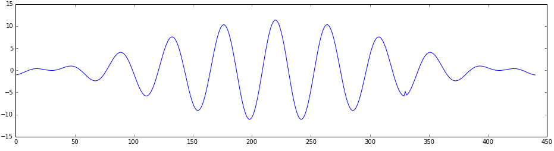
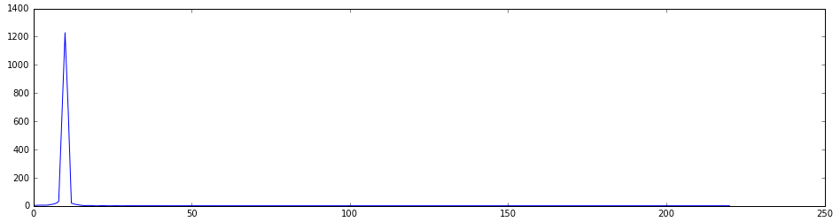
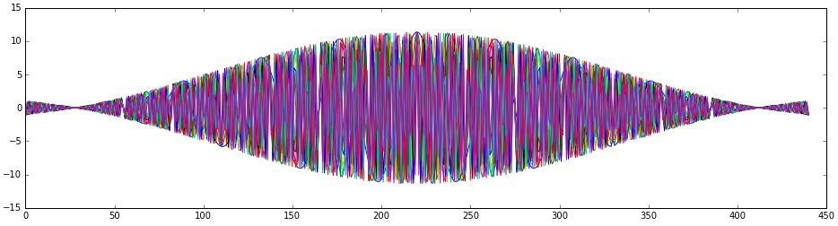
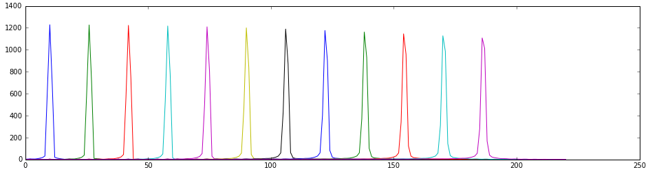

## Transmitter-receiver

This is a unguided communication project done for the (COM-302) *Principles of digital communication* class at EPFL.

The goal was to achieve a transmission of a ~160 character sentence by only using sound in less than 3 minutes. Additionally, structured noise was played during transmission.

### Design

The software starts by listening to the noise in order to understand its structure (2 distinct frequencies). It then computes as many pulses (modulated raised cosines) as possible such as they do not overlap with eachoter or with the noise in the frequency domain. After this, it encodes the message as a signal by assiging one or several pulses to one or more bits (depending on the configuration). Additionally, this signal is delimited by two pulses in order to achieve synchronization between the receiver and transmitter. The receiver simply consists of matched filters which are sampled in order to decode the signal.

  *Figure 1: Single raised cosine in the time domain* 

  *Figure 2: Single raised cosine in the frequency domain* 
  

  *Figure 3: Multiple raised cosines in the time domain* 

  *Figure 4: Multiple raised cosines in the frequency domain* 

### Setup

The code consists of a [Jupyter notebook](http://jupyter.org/) running on Python 3. The main packages are [NumPy](http://www.numpy.org/), [PyAudio](http://people.csail.mit.edu/hubert/pyaudio/) and [SciPy](https://www.scipy.org/scipylib/index.html).

The message to be sent should be written in the "textfile.txt" file.
Some example noise files are included ("interference.wav").

## Configuration 

In the configuration cell, serveral parameters are available : 

- `origin_dt`: Time before the signal starts playing [s]
- `analysis_dt`: Time during which the noise is analyzed [s]

- `rate`: Sampling rate of the microphone [Hz]
- `freq_min`: Smallest frequency useable by the pulses [Hz]
- `freq_max`: Largest frequency useable by the pulses [Hz]

- `pulse_dt`: Duration of single pulse [s]
- `pulse_df`: Frequency step between two pulses [Hz] 
- `pulse_bits`: Number of bits per symbol*
- `redundency`: Number of times a symbol* is repeated (should be odd as the median of the decoded bits is taken)

\* Symbol: Sum of pulses - in a signle pulse_dt, pulse_bits pulses are sent overlapped (summed), thus allowing for pulse_bits to be contained in pulse_dt seconds. 
